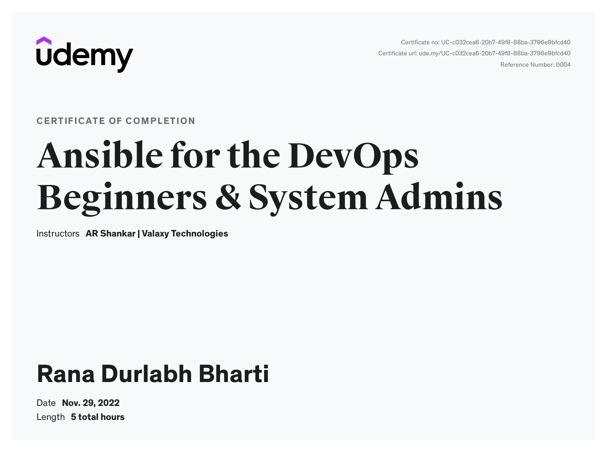

# Ansible for DevOps Beginners and System Admins

This is my notes of udemy course [Ansible for the DevOps Beginners & System Admins](https://www.udemy.com/course/valaxy-ansible/)

## Course Completion Certificate

- What you'll learn
    - Able to write ansible playbooks and roles
    - Automate regular system administration tasks

- In this course, we have covered

  - what is ansible

  - why do we need ansible

  - how ansible works

  - how to prepare an ansible system on AWS

  - installing ansible on EC2 instance

  - setup and RHEL as an ansible managed node

  - Ansible Ad-hoc commands

  - Ansible Inventory

  - Ansible configuration file - ansible.cfg

  - Ansible modules

  - create your 1st ansible-playbook

  - setup additional managed nodes

  - run a ansible playbook

  - Yum module to install packages

  - file module to create or remove a file

  - copy module to copy a file

  - Install apache on Rhel

  - install apache on ubuntu

  - notify and handlers in a playbook

  - how to gather facts works

  - how when condition works

  - uninstall apache using when the condition

  - adding copy task to apache playbook

  - ansible variables

  - convert shell commands into ansible-playbook

  - using tags in a playbook

  - error handling in the ansible playbook

  - ansible vault introduction

  - using ansible vault with git

  - ansible roles

  - convert a playbook into a role

  - push your playbooks onto GitHub 

- Who this course is for:
  - A begineer who are curious to learn Ansible
  - DevOps Engineer how doesn't know Configuration Management tool

- [Resources](https://github.com/yankils/ansible_for_beginners)